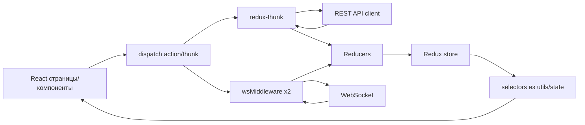
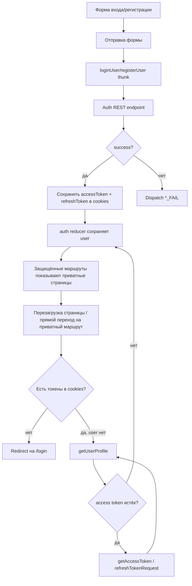
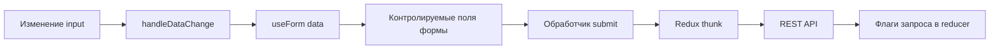
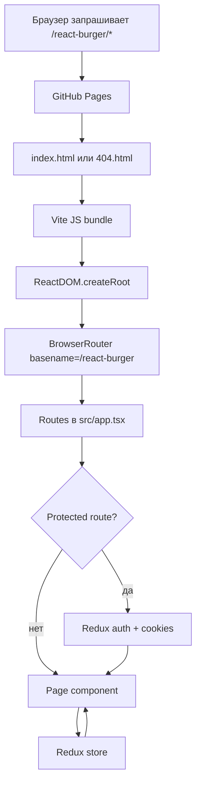
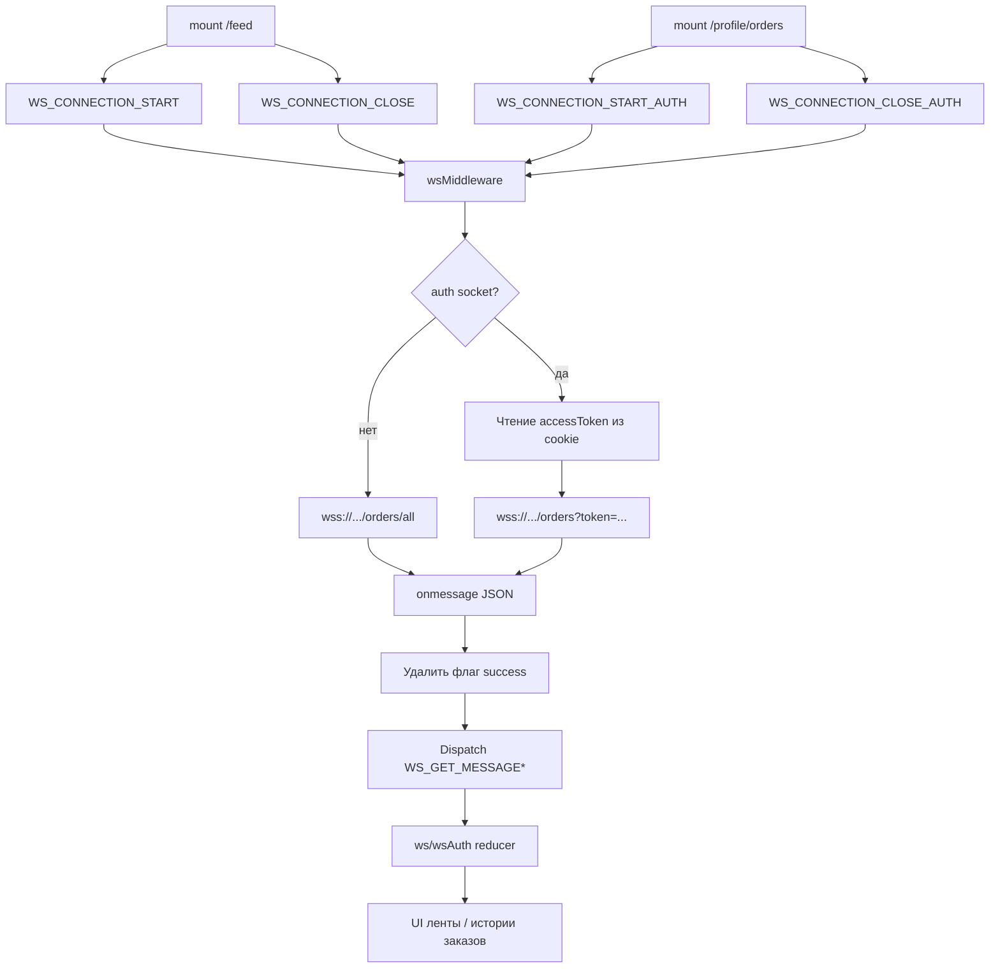
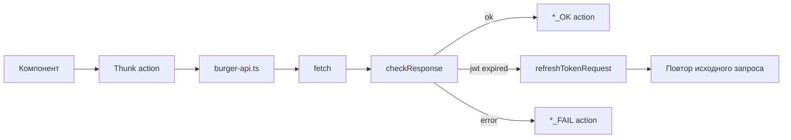

# Архитектура проекта

Документ описывает текущую архитектуру Stellar Burgers. Описание опирается на реализованный код, а не на целевую или идеальную архитектуру.

> Схема: [`project-architecture.svg`](./project-architecture.svg)

## Стек

| Слой | Технология |
| --- | --- |
| Сборка и dev server | Vite 5 |
| Язык | TypeScript |
| UI | React 18 |
| Стили | CSS Modules + utility-классы Practicum UI |
| Библиотека компонентов | `@ya.praktikum/react-developer-burger-ui-components` |
| Роутинг | `react-router-dom` v6 |
| Состояние | Redux 4 + `redux-thunk` |
| Drag and drop | `react-dnd`, `react-dnd-html5-backend` |
| Реальное время | Browser WebSocket API |
| Тесты | Vitest, Cypress |
| Деплой | GitHub Pages, Vite `base: '/react-burger/'` |

## Ключевые модули

| Модуль | Ответственность |
| --- | --- |
| `src/index.tsx` | Инициализирует React, Redux Provider и BrowserRouter. |
| `src/app.tsx` | Описывает маршруты, слой модальных маршрутов и стартовую загрузку ингредиентов. |
| `src/services/store.ts` | Создаёт Redux store с thunk и двумя экземплярами WebSocket middleware. |
| `src/services/reducers/index.ts` | Объединяет slices `ingredients`, `order`, `auth`, `ws` и `wsAuth`. |
| `src/utils/burger-api.ts` | REST API client и обёртка обновления токена. |
| `src/utils/auth.ts` | Helpers для cookies и доступа к токенам. |
| `src/utils/constants.ts` | Константы маршрутов, action type, WebSocket URL и поиск modal root. |
| `src/hooks/useForm.ts` | Общий helper для состояния контролируемых полей. |
| `src/components/protected-route/protected-route.tsx` | Guard для auth/guest маршрутов и восстановление сессии. |
| `src/services/middlewares/wsMiddlewares.ts` | Интеграция жизненного цикла WebSocket с Redux. |

## Архитектура Redux

### Slices

| Slice | Reducer | Данные |
| --- | --- | --- |
| `ingredients` | `ingredient-reducer.ts` | Список ингредиентов и флаги запроса. |
| `order` | `order-reducer.ts` | Состав конструктора, номер заказа, флаги запроса заказа. |
| `auth` | `auth-reducer.ts` | Пользователь и флаги auth/profile/password запросов. |
| `ws` | `ws-reducer.ts` | Заказы общей ленты, totals и состояние WebSocket. |
| `wsAuth` | `ws-auth-reducer.ts` | Заказы пользователя, totals и состояние WebSocket. |

## Авторизация

Авторизация основана на JWT-токенах Norma API, которые хранятся в cookies:

- `accessToken` сохраняется без префикса `Bearer `.
- `refreshToken` сохраняется как получен от сервера.
- Авторизованные REST-запросы используют `fetchWithRefresh`.
- Доступ к маршрутам контролирует `ProtectedRouteElement`.

### Файлы авторизации

- `src/services/actions/auth-actions.ts`
- `src/services/reducers/auth-reducer.ts`
- `src/utils/burger-api.ts`
- `src/utils/auth.ts`
- `src/components/protected-route/protected-route.tsx`

### Текущие ограничения

- UI не везде показывает ошибки auth API.
- Страница сброса пароля переходит на login после submit без явной проверки успешного результата в интерфейсе.
- Форма профиля использует `'******'` как placeholder пароля и не отправляет password, если он не менялся.

## Работа с формами и валидация

Общий hook `useForm` управляет только состоянием контролируемых полей:

`useForm` возвращает:

- `data`
- `handleDataChange`
- `setData`

Текущая валидация складывается из:

- HTML input types, например `email` и `password`;
- компонентов Practicum UI;
- серверных ответов API;
- логики конкретной страницы, например `isChanged` в профиле.

### Чего не хватает

Единой клиентской схемы валидации пока нет. Если формы будут развиваться, стоит добавить:

- правила валидации для каждой формы;
- сообщения об ошибках на уровне отдельных полей;
- отключение кнопок отправки для невалидных форм;
- общий UI отправки и ошибок, связанный с Redux-флагами запросов.

## Router, Redux и CSR

Проект является клиентской SPA. SSR-конвейер отсутствует.

### Замечания по роутингу

- `BrowserRouter` использует `basename` из `import.meta.env.BASE_URL`.
- Vite `base` равен `/react-burger/`, что соответствует GitHub Pages.
- Build копирует `dist/index.html` в `dist/404.html`, чтобы прямые переходы на вложенные маршруты работали.
- Модальные маршруты используют `location.state.background`, чтобы страница оставалась видимой под модальным окном.

### Про SSR

Поток иногда хочется назвать “Router-Redux-SSR”, но SSR в проекте не реализован:

- нет `renderToString`;
- нет `hydrateRoot`;
- нет серверного runtime;
- нет фреймворка вроде Next.js или Remix.

Точное название текущего потока — Router-Redux-CSR.

## WebSockets

Приложение использует два WebSocket-соединения через одну фабрику middleware:

- общая лента: `WSURL`, группа actions `wsActions`, reducer `ws`;
- лента пользователя: `WSURLAUTH`, группа actions `wsActionsAuth`, reducer `wsAuth`.

### Ограничения WebSocket

- Нет логики переподключения и backoff.
- Обработчики событий переназначаются, пока socket существует.
- Токен авторизации читается при обработке socket action; изменение токена требует переподключения.
- Reducers сохраняют массивы заказов и totals в том виде, в котором они пришли от сервера.

## Поток REST API

## Рекомендации

Полезные следующие документы:

1. `docs/deployment.md` про GitHub Pages, `base`, workflow и разбор проблем с кешем.
2. `docs/api.md` с контрактами endpoint и поведением токенов.
3. `docs/testing.md` про reducer tests на Vitest и потоки Cypress.
4. Будущий `docs/state-model.md`, если Redux slices продолжат расти.

Скорее всего, сейчас не нужны:

- отдельная SSR-документация, потому что SSR в приложении нет;
- отдельный SVG для каждого маленького потока: Mermaid внутри markdown проще поддерживать для auth/forms/router/ws.
