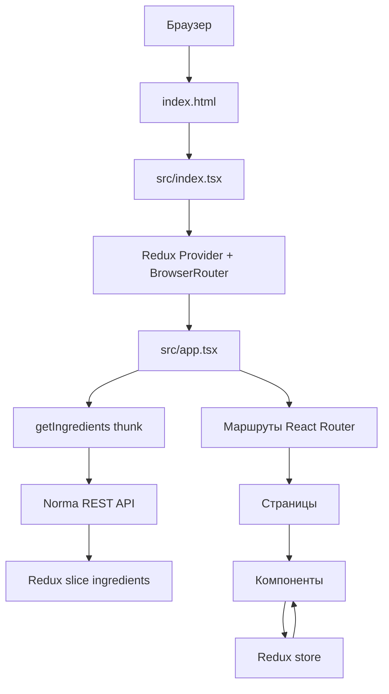
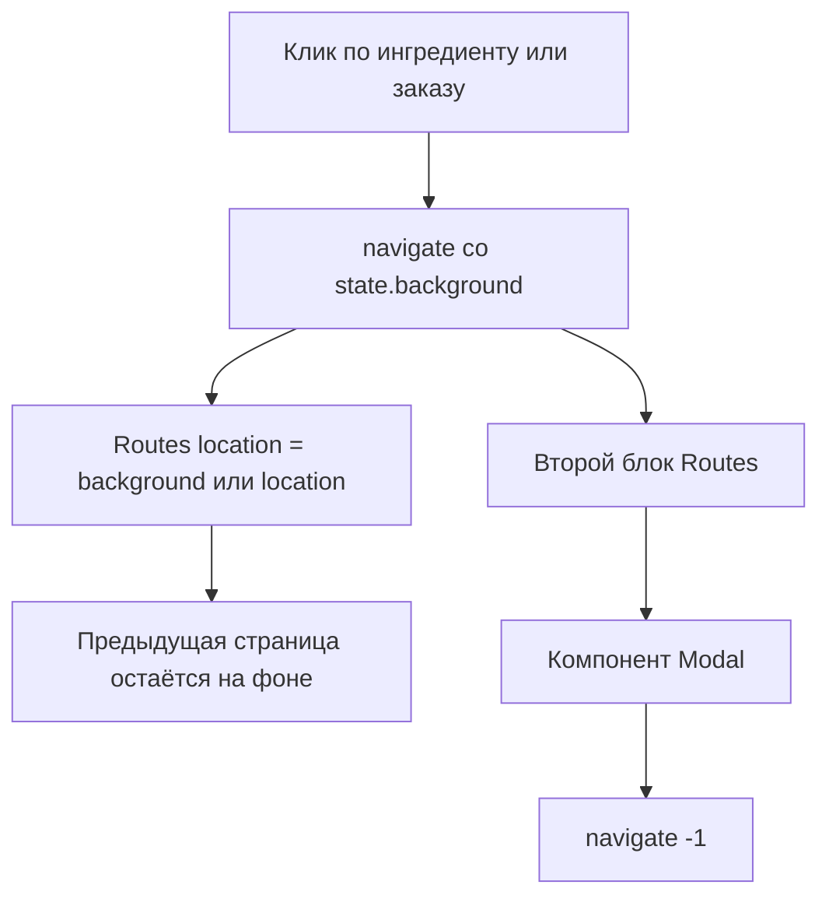

# Обзор проекта

Stellar Burgers — клиентское React-приложение для сборки бургеров, оформления заказов, просмотра общей ленты заказов и работы с профилем пользователя. Проект собирается как Vite SPA и разворачивается на GitHub Pages по пути `/react-burger/`.

> Схема: [`project-overview.svg`](./project-overview.svg)

## Что делает приложение

- Загружает ингредиенты из Norma API.
- Позволяет собрать бургер с помощью drag-and-drop.
- Поддерживает регистрацию, вход, редактирование профиля, восстановление пароля и выход.
- Хранит JWT-токены в cookies и обновляет access token при необходимости.
- Отправляет заказы авторизованных пользователей через REST API.
- Показывает общую и пользовательскую ленты заказов через WebSocket.
- Использует модальные маршруты для деталей ингредиента и деталей заказа.

## Верхнеуровневая структура

```text
.
├── cypress/                  # E2E-тесты и вспомогательные файлы Cypress
├── docs/                     # Документация и схемы проекта
├── public/                   # Статические файлы, копируемые в dist
├── src/
│   ├── components/           # Переиспользуемые UI-компоненты
│   ├── hooks/                # Типизированные Redux hooks и useForm
│   ├── images/               # Импортируемые изображения
│   ├── pages/                # Экраны верхнего уровня для маршрутов
│   ├── services/             # Redux store, reducers, actions, middleware, types
│   └── utils/                # API, cookies авторизации, constants, selectors
├── index.html                # HTML-оболочка Vite
├── vite.config.ts            # Конфигурация Vite/Vitest
└── package.json              # Скрипты и зависимости
```

## Поток запуска



## Основные пользовательские потоки

### Конструктор бургера

```mermaid
flowchart LR
  Ingredients[Список ингредиентов] --> Drag[Перетаскивание ингредиента]
  Drag --> Drop[Drop в конструктор]
  Drop --> Dispatch[ADD_BUN / ADD_INGREDIENT]
  Dispatch --> OrderSlice[order reducer]
  OrderSlice --> Constructor[UI конструктора]
  Constructor --> Submit[Оформить заказ]
  Submit --> AuthCheck{Пользователь авторизован?}
  AuthCheck -- нет --> Login[/login]
  AuthCheck -- да --> OrderApi[POST /orders]
  OrderApi --> OrderModal[Модалка подтверждения заказа]
```

### Модальные маршруты



## Ключевые маршруты

| Маршрут | Экран | Доступ |
| --- | --- | --- |
| `/` | Конструктор бургера и ингредиенты | Публичный |
| `/ingredients/:id` | Страница/модалка деталей ингредиента | Публичный |
| `/feed` | Общая лента заказов | Публичный |
| `/feed/:id` | Страница/модалка деталей заказа | Публичный |
| `/login` | Вход | Только гости |
| `/register` | Регистрация | Только гости |
| `/forgot-password` | Запрос кода восстановления | Только гости |
| `/reset-password` | Сброс пароля | Только гости после запроса кода |
| `/profile` | Форма профиля | Авторизованные пользователи |
| `/profile/orders` | История заказов пользователя | Авторизованные пользователи |
| `/profile/orders/:id` | Страница/модалка деталей заказа пользователя | Авторизованные пользователи |

## Источники данных

| Источник | Для чего используется | Основные файлы |
| --- | --- | --- |
| REST API | Ингредиенты, авторизация, профиль, создание заказа, заказ по номеру | `src/utils/burger-api.ts`, `src/services/actions/*` |
| Cookies | `accessToken`, `refreshToken` | `src/utils/auth.ts` |
| WebSocket общей ленты | Данные `/feed` | `src/pages/feed.tsx`, `src/services/middlewares/wsMiddlewares.ts` |
| WebSocket личной ленты | Данные `/profile/orders` | `src/pages/orders.tsx`, `src/services/middlewares/wsMiddlewares.ts` |
| Redux store | Общее клиентское состояние | `src/services/store.ts`, `src/services/reducers/*` |

## Важные замечания

- Приложение является клиентской SPA. SSR в текущем коде нет.
- Деплой на GitHub Pages опирается на Vite `base: '/react-burger/'` и копирование `dist/index.html` в `dist/404.html`.
- `src/utils/api.ts`, `src/utils/burdger-api.ts` и `src/utils/cookie.ts` — совместимые re-export файлы для старых импортов.
- Работа с формами централизована в `useForm`, но валидация в основном HTML/серверная, а не основанная на схеме.
- WebSocket middleware не содержит автоматического переподключения.

## Что стоит добавить позже

- Отдельный документ по API-контрактам с примерами запросов и ответов.
- Документ по стратегии тестирования: Vitest, Cypress, reducers и критичные пользовательские потоки.
- Runbook по деплою на GitHub Pages, переменным окружения и типовым ошибкам кеша.
- Диаграммы модели состояния для каждого Redux slice, если store продолжит расти.
